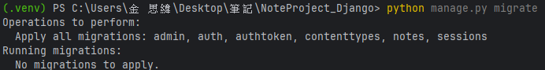

# 筆記應用 (Django Notes App)

這是一個基於 Django 和 Django REST Framework 構建的簡單筆記應用程式。
它提供：
- 使用者註冊、登入、登出功能 (基於 Djoser)
- CRUD (創建、讀取、更新、刪除) 個人筆記的功能

## 功能概覽

- **使用者認證**：安全的使用者管理 (Djoser)。
- **筆記管理**：針對登入使用者，提供個人筆記的增刪改查。
- **RESTful API**：可供其他前端應用程式或行動應用程式使用的 API 端點。
- **Django 模板前端**：基本的網頁介面，用於直接在瀏覽器中操作。
- **響應式設計**：使用 Bootstrap 5 確保在不同設備上的良好體驗。

## 實際操作影片

[](https://youtu.be/F6u1nqgSiOM "基於 Django 和 Django REST Framework 構建的簡單筆記應用程式 DEMO 影片")

## 如何運行此專案 

### 1. clone 儲存庫

```bash
git clone https://github.com/szweijin/NoteProject_Django.git 
cd NoteProject_Django
````

### 2\. 創建並激活虛擬環境

建議使用虛擬環境來管理依賴。

```bash
python3 -m venv .venv
source .venv/bin/activate  # macOS / Linux
# 或
.venv\Scripts\activate     # Windows
```

### 3\. 安裝依賴

```bash
pip install -r requirements.txt
```
#### **圖片示範：**


### 4\. 運行資料庫遷移

```bash
python manage.py migrate
```
#### **圖片示範：** 資料夾會自動出現 `db.sqlite3`

### 5\. 創建超級使用者 (管理員)

```bash
python manage.py createsuperuser
```
會出現
```bash
使用者名稱: (自訂)
電子郵件: (可略)
Password: (輸入時不會出現字元，只要輸入完按 enter 即可)
Password (again): (同上)
Superuser created successfully.
```
#### **圖片示範：** 如果密碼太短會問你要不要跳過，這裡選 `N` 再重設


### 6\. 運行開發伺服器

```bash
python manage.py runserver
```
#### **圖片示範：** 正常運行會可以點擊`http://127.0.0.1:8000/` 然後回報 `200`

### 7\. 訪問應用程式

在瀏覽器中打開 `http://127.0.0.1:8000/`

### 8\. DEMO 截圖畫面


### API 端點 

  - **使用者註冊**：`POST /auth/users/`
  - **使用者登入**：`POST /auth/token/login/`
  - **使用者登出**：`POST /auth/token/logout/`
  - **筆記列表與創建**：`GET /api/notes/` (List), `POST /api/notes/` (Create)
  - **筆記詳情、更新與刪除**：`GET /api/notes/{id}/`, `PUT /api/notes/{id}/`, `DELETE /api/notes/{id}/`


